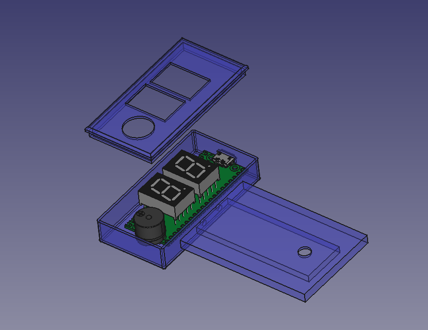
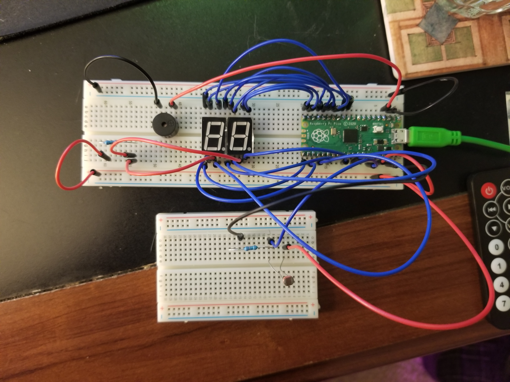

# The Annoying Book Mark

This book mark counts the amount of time that has passed since you last opened your book. If you don't open your book in time it beeps, and doesn't stop beeping until you open your book. 

STLs can be found in this project along with the free cad file

Parts List
* Raspberry Pi Pico
* LD-5161BB 7 segment display
* Photo Resistor 
* Passive Buzzer
* 1 220 Resistor (For Photo Resistor)
* 1 1k Resistor (For LED Segments)

TODO: replace this picture with an actual diagram 

GrabCad was used to help make the CAD Model
* Pi Pico - https://grabcad.com/library/raspberry-pi-pico-1
* Buzzer - https://grabcad.com/library/active-passive-piezo-buzzer-1
* 7 Seg Display - https://grabcad.com/library/7-segment-display-6